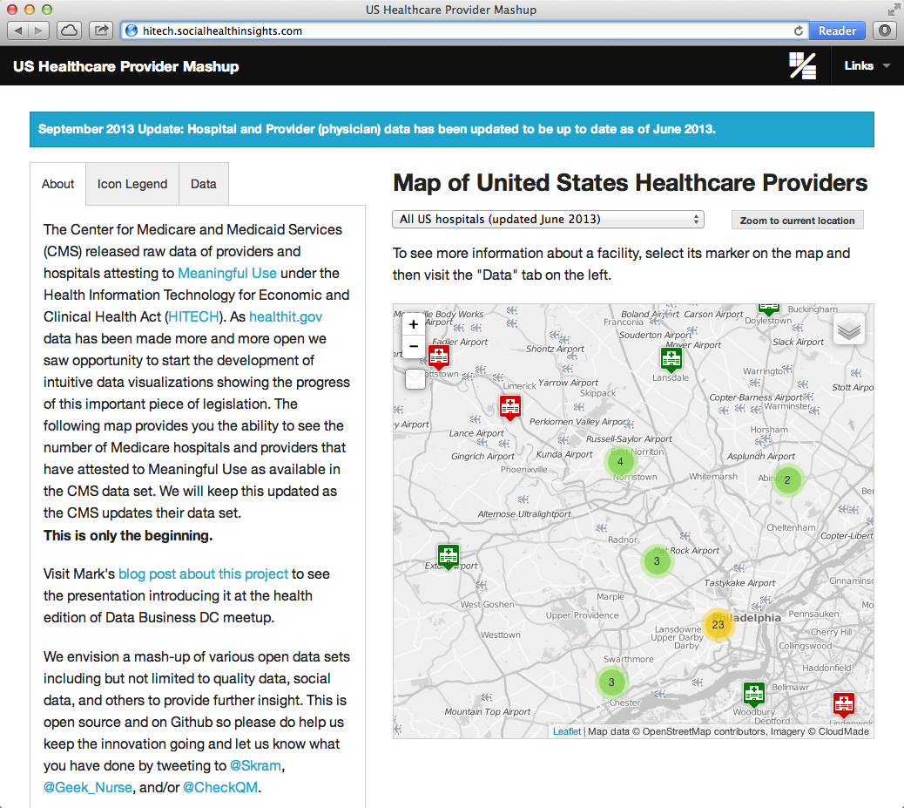

A repo for working with data from [CMS's EHR Incentive Programs Data and Program Reports page.](http://www.cms.gov/Regulations-and-Guidance/Legislation/EHRIncentivePrograms/DataAndReports.html) after a tweet from [@Cascadia](https://twitter.com/cascadia/status/307973508833615873) and subsequent chat through direct messages inspired me to do something with the data.

Screenshot
----------

*Screenshot last updated 9/12/2013 at 12pm EST*

Notes
-----
* Disclaimer front and center on the live site: according to [CMS's EHR Incentive Programs Data and Program Reports page](http://www.cms.gov/Regulations-and-Guidance/Legislation/EHRIncentivePrograms/DataAndReports.html), only hospital-level data on _Medicare_ eligible hospitals (EH) and providers (EP) are available as HITECH "Act does not require CMS to post the names of eligible professionals, eligible hospitals and CAHs that have received Medicaid EHR Incentive Program payments."
* All files in this repo's `data` directory are from [CMS's EHR Incentive Programs Data and Program Reports page](http://www.cms.gov/Regulations-and-Guidance/Legislation/EHRIncentivePrograms/DataAndReports.html). They are included only for convenience to fellow developers looking to get up and running with a copy of the data.
* Using [Data Science Toolkit](http://www.datasciencetoolkit.org/) for geocoding provider addresses but started getting 500 Internal Server Errors when using public DSTK host so I brought up my own instance (m1.medium) on Amazon EC2. If you choose to do the same, edit the `DSTK_HOST` variable in `lib/tasks/geocode.rake`
* *ProvidersPaidByEHRProgram_June2013* data files have been normalized by @geek_nurse and @skram to make them more suitable for database querying
* When geocoding, the address information from the CMS ProvidersPaidByEHRProgram is used, if available. If the provider has not received incentive payments or no address is available, the address from the Hospital General Information data set is used in the geocoding process
* The normalized EP spreadsheet has about 1,300 duplicate NPIs out of 190,000+. This is after the normalization effort.

Procedure
---------
**EH: Providers Paid By EHR Program: June 2013 Eligible Hospitals**
  
  1. Create a directory for the raw data and later exports:
  
        mkdir -p public/data/ProvidersPaidByEHRProgram_Sep2013_EH/

  2. Download data file:

        curl http://www.cms.gov/Regulations-and-Guidance/Legislation/EHRIncentivePrograms/Downloads/EH_ProvidersPaidByEHRProgram_Sep2013_FINAL.zip -o public/data/ProvidersPaidByEHRProgram_Sep2013_EH/EH_ProvidersPaidByEHRProgram_Sep2013_FINAL.zip

  3. Unzip data file:

        unzip public/data/ProvidersPaidByEHRProgram_Sep2013_EH/EH_ProvidersPaidByEHRProgram_Sep2013_FINAL.zip -d public/data/ProvidersPaidByEHRProgram_Sep2013_EH/

  4. Import CSV into MongoDB and ensure the fields are properly formatted. 

        bundle exec rake hospitals:ingest_latest_payments_csv
        bundle exec rake hospitals:ensure_fields_are_properly_formatted

  5. Bring in additional data from the General Hospital Information and HCAHPS (patient experience) data sets on Socrata:

        bundle exec rake hospitals:ingest_general_info
        bundle exec rake hospitals:ingest_hcahps
        bundle exec rake hospitals:ingest_joint_commission_ids
        bundle exec rake hospitals:ingest_hc_hais
        bundle exec rake hospitals:ingest_hc_hacs
        bundle exec rake hospitals:ingest_ahrq_m
        bundle exec rake hospitals:ingest_ooc

  6. Geocode provider addresses:

        bundle exec rake geocode

  7. Print out a nice little report about hospital counts with different types of data (geo, general info, hcahps):

        bundle exec rake hospitals:simple_report

  8. Export _select_ information to CSV for safe keeping and offline analysis: 

        mongoexport --csv -d cms_incentives -c ProvidersPaidByEHRProgram_June2013_EH -o public/data/ProvidersPaidByEHRProgram_June2013_EH/ProvidersPaidByEHRProgram_June2013_EH-normalized-geocodedAndSelectedData.csv -f "PROVIDER NPI,PROVIDER CCN,PROVIDER - ORG NAME,PROVIDER STATE,PROVIDER CITY,PROVIDER  ADDRESS,PROVIDER ZIP 5 CD,PROVIDER ZIP 4 CD,PROVIDER PHONE NUM,PROVIDER PHONE EXT,PROGRAM YEAR 2011,PROGRAM YEAR 2012,PROGRAM YEAR 2013,geo.provider,geo.updated_at,geo.data.types.0,geo.data.geometry.location.lat,geo.data.geometry.location.lng,general.hospital_type,general.hospital_owner,general.emergency_services,general.country_name,hcahps.survey_response_rate_percent,hcahps.number_of_completed_surveys,hcahps.percent_of_patients_who_reported_yes_they_would_definitely_recommend_the_hospital_,jc.org_id,hc_hais"
      
  9. Create MongoDB indexes:

        bundle exec rake mongodb:mongoid_create_indexes

  10. *If you intend to run the visualization in a production environemnt:*

        # You will want to create a static `.geojson` 
        bundle exec ruby web_app.rb -p 4567 -e development
        curl http://localhost:4567/db/cms_incentives/EH/all.geojson -o public/data/ProvidersPaidByEHRProgram_Sep2013_EH/geojson/all.geojson

        # Refresh the minified static assets
        rm public/static/*
        bundle exec rake assetpack:build
        # Clear AWS Cloudfront caches for static assets and root route.

**EP: Providers Paid By EHR Program: June 2013 Eligible Providers**
  
  1. Create a directory for the raw data and later exports:
  
        mkdir -p public/data/ProvidersPaidByEHRProgram_June2013_EP/

  2. Download data file:

        curl http://www.cms.gov/Regulations-and-Guidance/Legislation/EHRIncentivePrograms/Downloads/ProvidersPaidByEHRProgram_June2013_EP.zip -o public/data/ProvidersPaidByEHRProgram_June2013_EP/ProvidersPaidByEHRProgram_June2013_EP.zip

  3. Unzip data file:

        unzip public/data/ProvidersPaidByEHRProgram_June2013_EP/ProvidersPaidByEHRProgram_June2013_EP.zip -d public/data/ProvidersPaidByEHRProgram_June2013_EP/

  4. Import CSV into MongoDB and ensure the fields are properly formatted. _See EH section note for step 4 above. Same applies here, for EPs._    

        mongoimport --type csv -d cms_incentives -c ProvidersPaidByEHRProgram_June2013_EP --headerline --file public/data/ProvidersPaidByEHRProgram_June2013_EP/ProvidersPaidByEHRProgram_June2013_EP-normalizedByBrianNorris.csv

        bundle exec rake providers:ensure_fields_are_properly_formatted

  5. If you are running in a production environment, export the geojson to flat files (instead of hitting the database) by running the following rake task:

        bundle exec rake providers:output_provider_geojson_by_state
